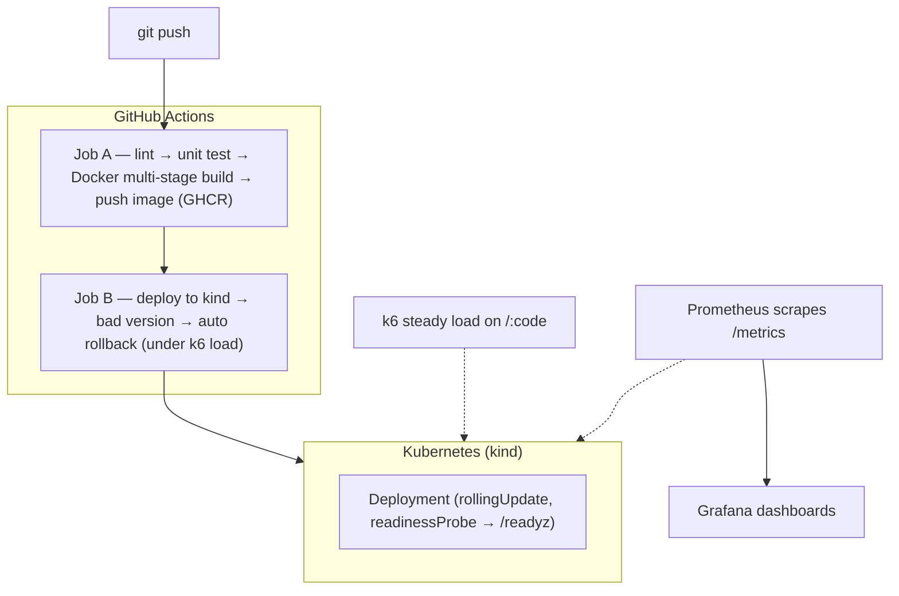

# cicd-rollback-demo

> **A container-based CI/CD pipeline that deploys a demo API with zero downtime and
> automatically rolls back bad versions.**

A small **URL-shortener** API is the payload that exercises the pipeline — the focus is the
**operations / pipeline** story, not the app: zero-downtime rolling deploys on Kubernetes and an
**automatic rollback** when a release fails its health check.

This is a self-contained, clean-room demo built from scratch — no proprietary code, and all
numbers are measured by this toy project itself.

---

## Status

| Phase | What | State |
|---|---|---|
| 0 | Repo, local datastores, env contract | ✅ done |
| 1 | Demo app (URL shortener) + Swagger/OpenAPI | ✅ done |
| 2 | CI: build / test / image (GitHub Actions, GHCR) | ⏳ next |
| 3 | CD: zero-downtime deploy on kind | ⏳ |
| 4 | Automatic rollback + CI integration test | ⏳ |
| 5–6 | Monitoring, metrics, README numbers + demo GIF | ⏳ |

> The pipeline phases below are placeholders until implemented.

---

## Architecture



### The demo app (the payload)

A URL shortener: `POST` a URL to get a short code, `GET` the code to be 301-redirected. Postgres is
the source of truth; Redis caches the redirect hot path. Health/readiness/version/metrics endpoints
back the monitoring and rollback demo.

| Method & path | Purpose |
|---|---|
| `POST /links` | Create a short link (`{ "url": "..." }` → `{ "code": "..." }`). Idempotent per URL. |
| `GET /:code` | Resolve and **301 redirect** (Redis first, Postgres on miss, then warm the cache). |
| `GET /healthz` | Liveness — always 200 while the process is alive. |
| `GET /readyz` | Readiness — 200 only when Postgres **and** Redis are reachable. The bad-version switch (`READY_OVERRIDE=fail`) forces 503 here. |
| `GET /version` | Build identity (`{ "sha": "<BUILD_SHA>" }`) — what the rollback demo watches flip back. |
| `GET /metrics` | Prometheus metrics (request count, latency histogram, cache hit/miss). |
| `GET /docs` | Interactive Swagger UI; the raw spec is at `/openapi.json` (also committed at [`app/openapi.json`](app/openapi.json)). |

---

## Run it locally

Prerequisites: **Node.js 20+** and **Docker** (for Postgres + Redis).

```bash
# 1. Start the datastores
docker compose up -d

# 2. Install deps and run the app (host) in watch mode
cp .env.example .env
npm --prefix app ci
npm --prefix app run dev
# → http://localhost:3000  (Swagger UI at /docs)

# 3. Try it
curl -s -X POST localhost:3000/links -H 'content-type: application/json' \
  -d '{"url":"https://example.com/a/very/long/path"}'      # → {"code":"..."}
curl -si localhost:3000/<code> | head -n1                  # → HTTP/1.1 301 Moved Permanently
```

### Tests, type-check, OpenAPI

```bash
npm --prefix app test       # unit tests (no DB/Redis needed — data layers are mocked)
npm --prefix app run lint   # tsc --noEmit type-check
npm --prefix app run openapi # regenerate app/openapi.json from the route annotations
```

### Container

```bash
docker build -t cicd-rollback-demo:dev \
  --build-arg BUILD_SHA=$(git rev-parse --short HEAD) app/
docker run --rm -p 3000:3000 --env-file .env cicd-rollback-demo:dev
```

---

## Configuration

All config is environment-driven (see [`.env.example`](.env.example)): `PORT`, `DATABASE_URL`,
`REDIS_URL`, `BUILD_SHA`, `READY_OVERRIDE`.

---

## Measured numbers

_Pending Phase 5 — P95 (cache hit vs. miss), TPS, 5xx during deploy (target 0%), and MTTR
(bad-deploy detection → automatic-rollback recovery) will be recorded here, each with its source
command and environment._

## Demo

_Pending Phase 5–6 — a GIF of the rollback moment alongside the k6 / Grafana graphs._
